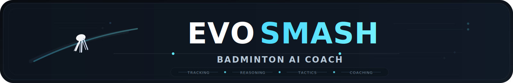

[中文](./README.md) | [English](./README.en.md)

<div align="center">



### AI-Driven Badminton Analysis & Tactical Evolution Platform

`Open-Source Competition Edition` · `Vision + Physics + Tactics + LLM` · `Interactive HUD Experience`

<p>
  
  
  
</p>

</div>

<div align="center">
  
</div>

<p align="center">
  <sub>Project poster generated by GPT Image 2</sub>
</p>

> What truly shapes a point is often not a single stroke, but the chain of decisions around it.  
> EvoSmash tries to capture those fleeting moments and turn instinct into something explainable, inspectable, and continuously improvable.

---

## Milestones

- **2026-02-10**: Congratulations! EvoSmash advanced to the **East China regional semifinal round** of the [China College Students' Software Innovation Competition](https://mp.weixin.qq.com/s/a9V7zMQrNaWmitfzfeiZVQ) 🚀
- **2026-04-20**: Congratulations! EvoSmash advanced further to the **national semifinal round** of the [China College Students' Software Innovation Competition](https://mp.weixin.qq.com/s/h6ggng0PPaO2icyPuNPayg) 🏆

<p align="center">
  <sub>Every round of progress matters. Every milestone makes the project more alive. ✨</sub>
</p>

---

## Project Snapshot

**EvoSmash** is a multimodal badminton analysis system for training and match understanding. It connects **computer vision**, **physics reasoning**, **referee logic**, **tactical retrieval**, and **LLM coaching feedback** into one interpretable pipeline.

Rather than only answering "what happened", EvoSmash also tries to answer:

- How did the shuttle move?
- Why did the rally unfold this way?
- Why is this tactic recommended now?
- How should the next adjustment be made more reliably?

---

<div align="center">
  
</div>

<p align="center">
  <sub>Starting from the real court, EvoSmash turns speed, judgment, adaptation, and confrontation into readable intelligence.</sub>
</p>

---

## Why EvoSmash

Many sports-analysis projects stop at detection or classification. **EvoSmash** focuses on a fuller and more explainable analysis chain.

It treats a rally as a continuous process from perception to reasoning, judgment, retrieval, and coaching feedback, making it closer to a lightweight **badminton intelligence system** than a simple visual demo.

---

## Core Capabilities

| Capability | Description |
| --- | --- |
| Vision Perception | Shuttle tracking, court understanding, and pose-aware motion feedback |
| Physics & Referee Reasoning | Coordinate mapping, speed estimation, landing judgment, and explainable referee logic |
| Tactical Memory | Tactical retrieval and evolution with semantics, context pressure, continuity, and Bayesian memory |
| AI Coaching | Concise, actionable, frontend-friendly coaching suggestions and tactical explanations |
| Product Experience | A mobile-first HUD-style interface for demos, reviews, and product-oriented presentation |

---

## Intelligence Pipeline

<div align="center">
  
</div>

<p align="center">
  <sub>A layered intelligence pipeline from video input to vision, physics, referee reasoning, tactical memory, and coaching output.</sub>
</p>

This pipeline is not designed to make a single module look powerful in isolation. Instead, each layer is meant to provide stable and interpretable signals for the next:

1. **Video Input**  
   Short rally clips or longer match segments enter the pipeline.

2. **Vision Perception**  
   Shuttle tracking, pose estimation, and court detection.

3. **Physics Engine**  
   Spatial mapping, speed estimation, landing reasoning, and trajectory quality.

4. **Referee Logic**  
   Structured judgments with confidence and rationale.

5. **Tactical Retrieval & Evolution**  
   Tactical ranking based on relevance, pressure state, continuity, and adaptive memory.

6. **Coach Agent & Frontend HUD**  
   Human-readable summaries, tactical cards, replay reports, and coaching suggestions.

---

## Product Highlights

### 1. Multi-Rally Tactical Memory

- Looks beyond a single shot and tracks tactical drift across recent rallies
- Produces frontend-friendly sequence memory signals
- Gives real context for why a tactic is recommended now

### 2. Tactical Duel Projection

- Predicts likely opponent responses to the current recommended tactic
- Outputs frontend-friendly `why_this_tactic` and `risk_note`
- Upgrades results from a tactic list into a tactical confrontation view

### 3. Replay Storyboard

- Organizes analysis into an easy-to-read replay story
- Highlights turning points, adaptation cycles, critical rallies, and closing state
- Better suited for demos, judging, and structured reporting

### 4. Human-Centered Explainability

- Preserves intermediate diagnostics when automatic reasoning is uncertain
- Supports debugging, replay analysis, and human correction
- Focuses on reasoning trails, not only final answers

---

## Interface Preview

<table align="center">
  <tr>
    <td align="center" width="25%">
      
    </td>
    <td align="center" width="25%">
      
    </td>
    <td align="center" width="25%">
      
    </td>
    <td align="center" width="25%">
      
    </td>
  </tr>
</table>

<p align="center">
  <sub>Real-time HUD results, multi-rally memory, tactical confrontation projection, replay reports, and AI coaching feedback.</sub>
</p>

---

## Quick Start

### 1. Start Backend

```bash
cd backend
python -m venv venv
```

Windows:

```bash
.\venv\Scripts\activate
```

macOS / Linux:

```bash
source venv/bin/activate
```

Install dependencies and run:

```bash
pip install -r requirements.txt
python main.py
```

### 2. Prepare Checkpoints

Place the required checkpoints into `backend/checkpoints/`:

```text
TrackNet_best.pt
InpaintNet_best.pt
yolov8n-pose.pt
```

### 3. Start Frontend

```bash
npm install
npm run dev
```

Open:

```text
http://localhost:5173
```

---

## API Surface

### `POST /analyze_rally`

Analyzes a short rally clip and returns:

- speed and event type
- automatic judgment result
- tactic recommendation and explanation
- AI coaching output
- rally summary and diagnostics

### `POST /analyze_match`

Analyzes longer video segments, splits multiple rallies, and returns a structured timeline.

### `POST /feedback`

Accepts human feedback for later tactical correction and policy updates.

---

## Project Structure

```text
EvoSmash/
├─ src/
│  ├─ components/
│  ├─ context/
│  ├─ pages/
│  ├─ styles/
│  └─ utils/
├─ backend/
│  ├─ core/
│  │  ├─ vision/
│  │  ├─ physics/
│  │  ├─ memory/
│  │  ├─ agent/
│  │  └─ utils/
│  ├─ services/
│  ├─ schemas/
│  ├─ checkpoints/
│  ├─ db/
│  └─ main.py
├─ android/
├─ assets/
│  └─ pic/
└─ README.md
```

---

## Roadmap

- Full-match timeline visualization
- Deeper biomechanics analysis
- More complete AR overlay and replay experience
- Long-term personalized player profiling
- Multi-device and cloud deployment support

---

## Contributors

- [yanpeigong](https://github.com/yanpeigong)
- [PM_Liu](https://github.com/PM-Liu)
- [Serendipity985](https://github.com/Serendipity985)
- [Severus-C](https://github.com/Severus-C)

---

## Acknowledgements

Thanks to everyone exploring how AI, computer vision, reasoning systems, and interaction design can improve sports training tools. 💙

If this project helps people think about sports not only as competition, but also as perception, judgment, and evolution, then EvoSmash has already done something meaningful.
