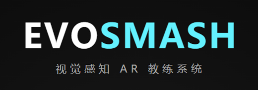
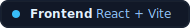
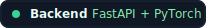
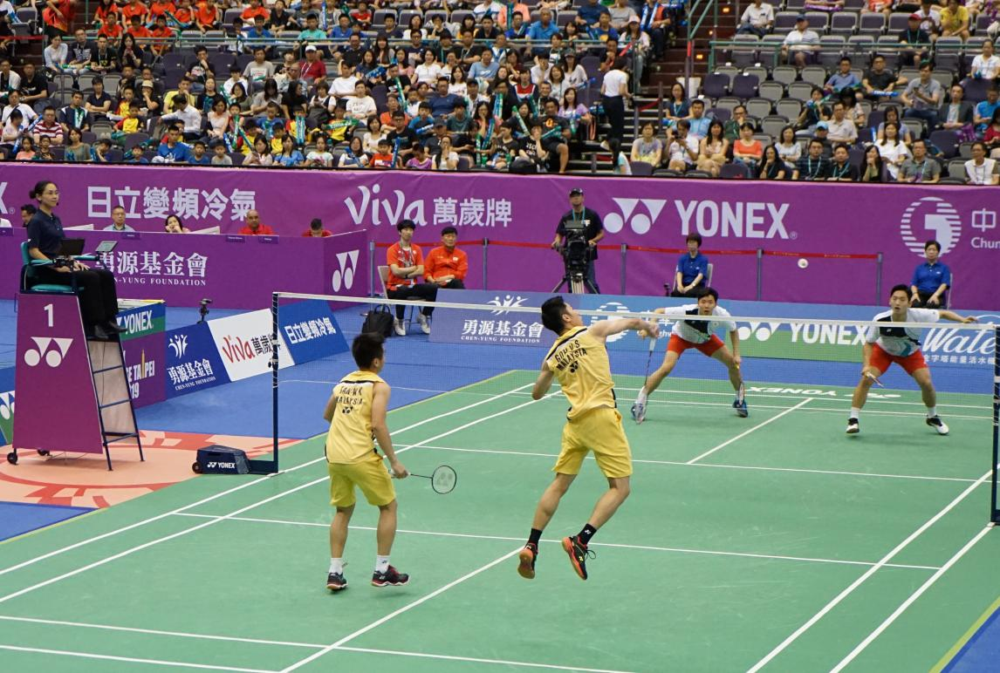
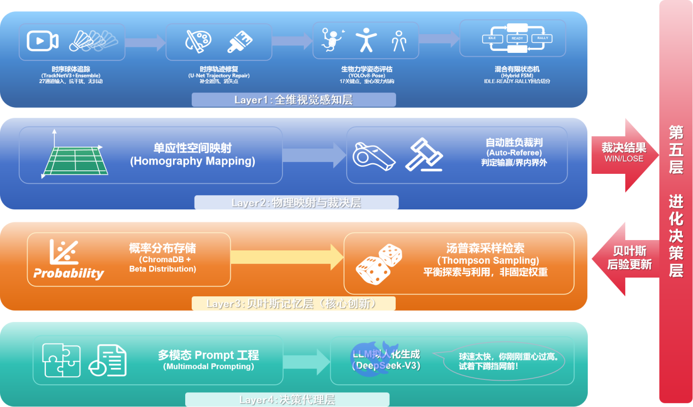
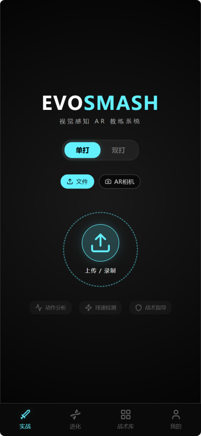
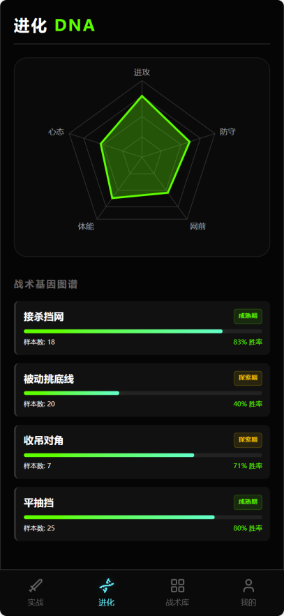
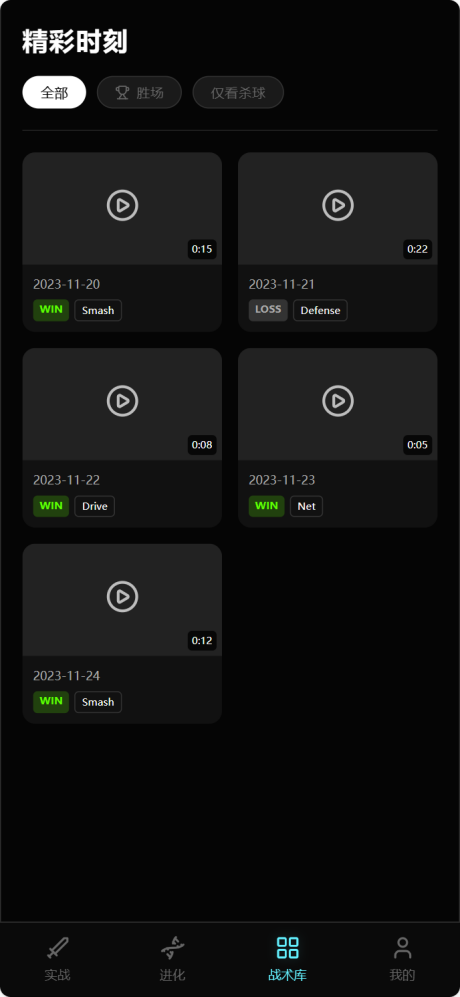
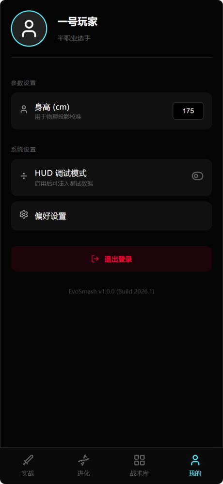

<div align="center">



### AI-Driven Badminton Analysis & Tactical Evolution Platform

`Open-Source Competition Edition` · `Vision + Physics + Tactics + LLM` · `Interactive HUD Experience`

<p>
  
  
  
</p>

</div>

> 真正决定胜负的，往往不是某一次击球本身，而是它前后那些未被看见的选择。  
> EvoSmash 试图记录这些转瞬即逝的瞬间，把经验从直觉变成可以被理解、被解释、也可以继续进化的认知。

---

## Milestones

- **2026-02-10**：🎉 Congratulations！EvoSmash 成功进入 **全国大学生创新大赛华东区域赛复赛** 🚀
- **2026-04-20**：🎉 Congratulations！EvoSmash 更进一步，成功进入 **全国复赛** 🏆

<p align="center">
  <sub>Every round of progress matters. Every milestone makes the project more alive. ✨</sub>
</p>

---

## Project Snapshot

**EvoSmash** 是一个面向羽毛球训练与比赛分析场景的多模态智能系统。  
它将 **计算机视觉**、**物理推理**、**自动裁判逻辑**、**战术检索** 与 **LLM 教练建议** 串联成一条完整分析链路，把普通回合视频转化为可读、可解释、可演化的智能反馈。

它希望回答的不只是“发生了什么”，还包括：

- 球是如何飞行的
- 这一分为什么会这样发生
- 当前战术为什么值得推荐
- 下一次应该如何更稳定地完成调整

---

<div align="center">
  
</div>

<p align="center">
  <sub>从真实赛场出发，让速度、判断、对抗与调整，都能被转译成更可理解的智能反馈。</sub>
</p>

---

## Why EvoSmash

很多运动分析项目停留在“检测”或“分类”层面，而 **EvoSmash** 更关注一条完整、连续、可解释的分析链路。

它把一次回合视为从感知、推理、判定、检索到反馈的连续过程，因此它更像一个轻量级、可交互、可扩展的 **Badminton Intelligence System**，而不只是一个视觉演示 Demo。

---

## Core Capabilities

| Capability | Description |
| --- | --- |
| Vision Perception | 追踪羽毛球轨迹、识别场地结构、分析球员姿态与动作反馈 |
| Physics & Referee Reasoning | 完成坐标映射、速度估计、落点判断、轨迹质量评估与自动裁判解释 |
| Tactical Memory | 基于语义匹配、上下文压力、连续性与 Bayesian 记忆完成战术检索与演化 |
| AI Coaching | 输出简洁、可执行、适合前端展示的建议、摘要与战术解释 |
| Product Experience | 使用移动优先 HUD 风格呈现结果，适合答辩、演示与产品化延展 |

---

## Intelligence Pipeline

<div align="center">
  
</div>

<p align="center">
  <sub>从视频输入到视觉感知、物理推理、裁判逻辑、战术记忆与教练生成的分层智能链路。</sub>
</p>

这条链路并不追求单一模块“看起来很强”，而是强调每一层都能为下一层提供稳定、可解释的信号：

1. **Video Input**  
   输入短回合视频或连续比赛片段。

2. **Vision Perception**  
   完成羽毛球追踪、球员姿态估计与场地检测。

3. **Physics Engine**  
   将视觉坐标映射到球场空间，估计球速、落点与轨迹质量。

4. **Referee Logic**  
   输出结构化判定结果，并给出可信度与解释依据。

5. **Tactical Retrieval & Evolution**  
   检索最相关战术，综合风险、连续性、压力状态进行排序，并根据结果更新策略先验。

6. **Coach Agent & Frontend HUD**  
   将复杂分析压缩成更适合人理解与执行的摘要、战术卡片、回放报告与建议。

---

## Product Highlights

### 1. Multi-Rally Tactical Memory

- 不只分析当前这一拍，而是回看最近若干回合的战术漂移与压力变化
- 输出更适合前端展示的 `sequence memory`
- 让“为什么现在推荐这一策略”拥有连续上下文支撑

### 2. Tactical Duel Projection

- 针对当前推荐战术，预测对手更可能的回应方式
- 给出 `why_this_tactic` 与 `risk_note`
- 帮助结果页从“推荐列表”升级为“对抗推演卡片”

### 3. Replay Storyboard

- 将回合分析组织成更易浏览的 `replay story`
- 展示 turning points、adaptation cycles、critical rallies 与 closing state
- 更适合竞赛演示、评审理解与后续报告沉淀

### 4. Human-Centered Explainability

- 即使自动判定不够稳定，系统仍会保留诊断信息与中间信号
- 方便调试、复盘与人工修正
- 保证系统不是“只给结论”，而是“给出 reasoning trail”

---

## Interface Preview

<table align="center">
  <tr>
    <td align="center" width="25%">
      
    </td>
    <td align="center" width="25%">
      
    </td>
    <td align="center" width="25%">
      
    </td>
    <td align="center" width="25%">
      
    </td>
  </tr>
</table>

<p align="center">
  <sub>实时 HUD 结果页、多回合记忆、战术对抗推演、可回放分析报告与 AI 教练反馈。</sub>
</p>

---

<!-- ## Tech Stack

### Frontend

- React 19
- Vite
- React Router
- Framer Motion
- Recharts
- Capacitor
- Lucide React

### Backend

- FastAPI
- PyTorch
- OpenCV
- Ultralytics YOLO
- ChromaDB
- OpenAI-compatible API -->

<!-- ### Core Directions

- Shuttle trajectory tracking
- Pose analysis and motion feedback
- Physics-based rally interpretation
- Auto referee reasoning
- Tactical retrieval and Bayesian evolution
- LLM-generated coaching advice

--- -->

## Quick Start

### 1. Start Backend

```bash
cd backend
python -m venv venv
```

Windows:

```bash
.\venv\Scripts\activate
```

macOS / Linux:

```bash
source venv/bin/activate
```

Install dependencies and run:

```bash
pip install -r requirements.txt
python main.py
```

### 2. Prepare Checkpoints

将模型文件放入 `backend/checkpoints/`：

```text
TrackNet_best.pt
InpaintNet_best.pt
yolov8n-pose.pt
```

### 3. Start Frontend

```bash
npm install
npm run dev
```

Open:

```text
http://localhost:5173
```

### 4. Build for Android

```bash
npm run build
npx cap sync
npx cap open android
```

---

## API Surface

### `POST /analyze_rally`

分析短回合视频，并返回：

- 球速与事件类型
- 自动判定结果
- 战术推荐与解释摘要
- AI 教练输出
- 回合摘要与诊断信息

### `POST /analyze_match`

分析更长的视频片段，自动切分多个回合并返回结构化时间线结果。

### `POST /feedback`

提交人工反馈，用于后续战术修正与策略更新。

---

## Project Structure

```text
EvoSmash/
├─ src/
│  ├─ components/
│  ├─ context/
│  ├─ pages/
│  ├─ styles/
│  └─ utils/
├─ backend/
│  ├─ core/
│  │  ├─ vision/
│  │  ├─ physics/
│  │  ├─ memory/
│  │  ├─ agent/
│  │  └─ utils/
│  ├─ services/
│  ├─ schemas/
│  ├─ checkpoints/
│  ├─ db/
│  └─ main.py
├─ android/
├─ assets/
│  └─ pic/
└─ README.md
```

## Demo Notes

- 支持 **HUD Debug Mode**，便于比赛展示与答辩演示
- 即使完整链路未全部接通，也可以展示核心交互流程
- 适合开源竞赛、课程项目展示、产品概念验证与后续扩展

---

## Roadmap

- 整场比赛时间线可视化
- 更深入的生物力学分析
- 更完整的 AR 覆盖与回放体验
- 个性化长期球员画像
- 多设备与云端部署支持

---

## Contributors

感谢每一位让这个仓库更完整的人，也感谢每一次认真对待“为什么这一分会这样发生”的追问。✨

- [yanpeigong](https://github.com/yanpeigong)
- [PM_Liu](https://github.com/PM-Liu)
- [Serendipity985](https://github.com/Serendipity985)
- [Severus-C](https://github.com/Severus-C)

---

## Acknowledgements

Thanks to everyone exploring how AI, computer vision, reasoning systems, and interactive design can create better sports training tools. 💙

If this project helps you think about sports not only as competition, but also as perception, judgment, and evolution, then EvoSmash has already done something meaningful.
