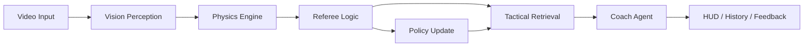

<div align="center">

# EvoSmash 🏸

### AI 驱动的羽毛球智能分析与战术进化平台

`Open-Source Competition Edition` · `Bilingual README` · `Vision + Physics + Tactics + LLM`

</div>

> 真正决定胜负的，往往不是某一次击球，而是它前后那些未被注意的选择。EvoSmash 记录这些转瞬即逝的瞬间，将经验从直觉变为可解释的认知——让进化不再只靠天赋和重复。

---

## Overview | 项目简介

**EvoSmash** 是一个面向羽毛球训练与比赛分析场景的多模态智能系统，将**计算机视觉**、**物理推理**、**自动裁判逻辑**、**战术检索**与 **LLM 教练建议**串联成一条完整链路。

它能够将原始回合视频转化为结构化的比赛洞察，包括球路轨迹、动作反馈、战术建议，以及可持续进化的决策支持。

---

## Snapshot | 一眼看懂

| 维度 | 说明 |
| --- | --- |
| 项目类型 | AI + 体育 + 交互式分析系统 |
| 核心场景 | 回合视频分析、战术建议、训练反馈 |
| 关键能力 | 视觉感知 + 物理推理 + 战术进化 |
| 展示风格 | 移动优先 HUD 界面与可解释输出 |
| 适用场景 | 开源展示、竞赛答辩、Demo 演示与后续产品化 |

---

## Contributors | 贡献者

- [yanpeigong](https://github.com/yanpeigong)
- [PM_Liu](https://github.com/PM-Liu)
- [Serendipity985](https://github.com/Serendipity985)
- [Severus-C](https://github.com/Severus-C)

---

## Why EvoSmash | 为什么是 EvoSmash

很多运动分析项目停留在“检测”或“分类”层面，而 **EvoSmash** 更关注完整分析链路。它将一次回合视为从感知、推理、判定、检索到反馈的连续过程。

这让它不只是一个视觉识别 Demo，更像一个轻量级、可交互、可扩展的**羽毛球智能分析系统**。

---

## Highlights | 核心亮点

### 1. Vision-Driven Rally Analysis 👁️

- 从回合视频中追踪羽毛球轨迹。
- 检测场地结构，并支持单打 / 双打判定逻辑。
- 分析球员姿态，输出动作反馈。

### 2. Physics + Referee Reasoning ⚖️

- 将图像坐标映射到球场物理空间。
- 估计球速、落点可信度与轨迹质量。
- 结合裁判逻辑输出结构化判定结果与解释。

### 3. Tactical Retrieval and Evolution 🧠

- 基于 Bayesian 战术记忆进行检索。
- 结合语义相关性、上下文匹配、压力适配和风险控制完成排序。
- 根据回合结果更新战术先验，实现持续进化。

### 4. AI Coaching Experience ✨

- 生成简洁、可执行的 AI 教练建议。
- 以 HUD 风格的移动优先界面展示结果。
- 支持 Debug Mode，方便演示与比赛展示。

---

## Innovation | 创新点

### Multilayer Intelligence Pipeline

EvoSmash 并不将任务简化成单一模型预测，而是构建了分层智能链路：**视觉感知**、**物理推理**、**裁判判定**、**战术记忆**与**教练生成**。

### Adaptive Tactical Memory

战术记忆并非静态库。系统可根据回合结果动态更新推荐策略，让建议随使用过程逐步进化，而不是机械重复固定规则。

### Human-Centered Feedback Loop

当自动判定不够稳定时，系统依然能够输出可解释的诊断信息，并为后续的人在回路修正保留空间。

---

## Architecture | 系统架构

### Layered Modules

| Layer | Module | Responsibility |
| --- | --- | --- |
| L1 | Vision Perception | Shuttle tracking, pose estimation, court detection |
| L2 | Physics Engine | Coordinate mapping, speed estimation, trajectory profiling |
| L3 | Referee Logic | Rally judgment, landing confidence, result explanation |
| L4 | Tactical Memory | Retrieval, ranking, Bayesian evolution, policy update |
| L5 | Coach Agent | Short tactical guidance and natural-language feedback |
| L6 | Frontend Experience | HUD interface, history view, profile, debug interaction |

### Data Flow



---

## Tech Stack | 技术栈

### Frontend

- React 19
- Vite
- React Router
- Framer Motion
- Recharts
- Capacitor
- Lucide React

### Backend

- FastAPI
- PyTorch
- OpenCV
- Ultralytics YOLO
- ChromaDB
- OpenAI-compatible API

### Core Capabilities

- Shuttle trajectory tracking
- Pose analysis and motion feedback
- Physics-based rally interpretation
- Auto referee reasoning
- Tactical retrieval and Bayesian evolution
- LLM-generated coaching advice

---

## Product Experience | 产品体验

### Arena 流程

1. 选择 **Singles** 或 **Doubles** 模式。
2. 上传回合视频，或通过相机流程录制片段。
3. 后端完成追踪、动作分析、物理推理与战术检索。
4. 前端展示球速、回合摘要、诊断信号、战术卡片与教练建议。
5. 利用回合结果信号推动策略更新与演化。

---

## Quick Start | 快速开始

### Prerequisites | 环境要求

- Node.js 16+
- Python 3.9+
- Optional: Android Studio for mobile packaging

### 1. Start Backend | 启动后端

```bash
cd backend
python -m venv venv
```

Windows:

```bash
.\venv\Scripts\activate
```

macOS / Linux:

```bash
source venv/bin/activate
```

Install dependencies and run:

```bash
pip install -r requirements.txt
python main.py
```

### 2. Prepare Model Checkpoints | 准备模型权重

将所需模型文件放入 `backend/checkpoints/` 目录：

```text
TrackNet_best.pt
InpaintNet_best.pt
yolov8n-pose.pt
```

### 3. Start Frontend | 启动前端

```bash
npm install
npm run dev
```

Open in browser:

```text
http://localhost:5173
```

### 4. Build for Android | 构建 Android 版本

```bash
npm run build
npx cap sync
npx cap open android
```

---

## Project Structure | 项目结构

```text
EvoSmash/
├─ src/                     # Frontend source code
│  ├─ components/           # Shared UI components
│  ├─ context/              # Global state
│  ├─ pages/                # Arena, Evolution, Library, Profile
│  ├─ styles/               # CSS styles
│  └─ utils/                # API and helper utilities
├─ backend/                 # FastAPI backend
│  ├─ core/
│  │  ├─ vision/            # Tracking, pose, court detection
│  │  ├─ physics/           # Physics reasoning and referee logic
│  │  ├─ memory/            # Tactical memory and evolution
│  │  ├─ agent/             # LLM coach agent
│  │  └─ utils/             # Match segmentation utilities
│  ├─ services/             # Analysis and enrichment services
│  ├─ schemas/              # Response schemas
│  ├─ checkpoints/          # Model weights
│  ├─ db/                   # Vector store
│  └─ main.py               # API entry
├─ android/                 # Capacitor Android project
├─ public/                  # Static assets
└─ README.md
```

---

## API Overview | 接口概览

### `POST /analyze_rally`

分析短回合视频，并返回：

- 球速与事件类型
- 自动判定结果
- 战术推荐
- AI 教练输出
- 摘要与诊断信息

### `POST /analyze_match`

分析更长的视频片段，自动切分多个回合并返回结构化时间线结果。

### `POST /feedback`

提交人工反馈，用于后续战术策略修正以及更新。

---

## Demo Notes | 演示说明

- 前端提供 **HUD Debug Mode** 用于界面演示。
- 即使完整推理链路未全部运行，也可以展示核心交互流程。
- 适合评审、演示和开源竞赛展示场景。

---

## Roadmap | 未来规划

- 整场比赛时间线可视化
- 更深入的生物力学分析
- 更完整的 AR 覆盖与回放体验
- 个性化长期球员画像
- 多设备与云端部署支持

---

## Acknowledgements | 致谢

Thanks to everyone exploring how AI, computer vision, reasoning systems, and interactive design can create better sports training tools. 💙

感谢所有尝试将 AI、计算机视觉、推理系统与交互设计结合到体育训练场景中的开发者与研究者。💙


