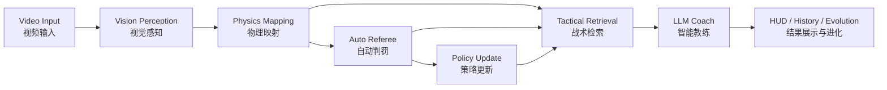

# EvoSmash 🏸

> AI-powered badminton analysis, coaching, and tactical evolution platform  
> 基于视觉感知、物理推理与智能教练的羽毛球分析与进化平台

EvoSmash is a multimodal badminton intelligence system that combines computer vision, physics-based reasoning, tactical retrieval, and AR-style feedback into one end-to-end experience. It is designed to help players capture rally clips, analyze shuttle movement and body mechanics, receive coaching advice, and continuously evolve their tactical decision-making.

EvoSmash 是一个面向羽毛球训练与竞技场景的多模态智能系统，融合了计算机视觉、物理推理、战术检索与 AR 风格反馈。它帮助用户录制或上传回合视频，分析球路与动作表现，生成教练建议，并通过数据驱动持续进化战术决策。

## Contributors | 贡献者 🤝

- [yanpeigong](https://github.com/yanpeigong)
- [PM_Liu](https://github.com/PM-Liu)
- [Serendipity985](https://github.com/Serendipity985)
- [Severus-C](https://github.com/Severus-C)

## Table of Contents | 目录

- [Project Overview | 项目概述](#project-overview--项目概述)
- [Highlights | 项目亮点](#highlights--项目亮点)
- [Innovation | 创新点](#innovation--创新点)
- [Architecture | 系统架构](#architecture--系统架构)
- [Tech Stack | 技术栈](#tech-stack--技术栈)
- [Workflow | 使用流程](#workflow--使用流程)
- [Quick Start | 快速开始](#quick-start--快速开始)
- [Project Structure | 项目结构](#project-structure--项目结构)
- [API Overview | 接口概览](#api-overview--接口概览)
- [Roadmap | 未来规划](#roadmap--未来规划)
- [Contributing | 参与贡献](#contributing--参与贡献)

## Project Overview | 项目概述 ✨

**EvoSmash** aims to build a next-generation badminton training assistant for mobile and web scenarios. By connecting shuttle tracking, pose analysis, auto-refereeing, tactical retrieval, and LLM coaching, the project turns raw video into interpretable performance feedback.

**EvoSmash** 旨在打造一个面向移动端与 Web 场景的下一代羽毛球训练助手。项目通过串联球路追踪、姿态分析、自动判罚、战术检索与大模型教练能力，将原始视频转化为可解释、可行动的训练反馈。

## Highlights | 项目亮点 🚀

### 1. Vision-Driven Rally Intelligence | 视觉驱动的回合理解 👀

- Track shuttle trajectory from video clips with CV models.
- Analyze player pose and extract movement feedback.
- Detect court area and support singles / doubles judgment logic.

- 使用计算机视觉模型追踪羽毛球轨迹。
- 分析球员姿态并提取动作反馈。
- 自动识别场地区域，支持单打 / 双打判罚逻辑。

### 2. Physics + Referee Logic | 物理推理与裁判逻辑融合 📐

- Convert image coordinates into world-space estimations.
- Estimate shuttle speed and infer rally outcomes automatically.
- Provide structured descriptions that can be consumed by tactical and coaching modules.

- 将图像坐标映射到物理空间。
- 估算球速并自动推断回合结果。
- 输出结构化描述，供战术检索与教练模块进一步使用。

### 3. Tactical Retrieval and Evolution | 战术检索与进化机制 🧠

- Retrieve tactical suggestions from a Bayesian RAG memory.
- Update tactic priors from rally outcomes to support continuous evolution.
- Balance semantic similarity and exploration through probabilistic ranking.

- 基于贝叶斯记忆库检索战术建议。
- 利用回合结果更新战术先验，实现持续进化。
- 通过概率排序平衡语义相关性与探索能力。

### 4. Immersive Coaching Experience | 沉浸式智能教练体验 🎯

- Present analysis in a HUD-style mobile interface.
- Offer AI-generated short coaching instructions.
- Support debug mode for UI demonstration without a fully running backend.

- 以 HUD 风格移动界面展示分析结果。
- 生成简洁直接的 AI 教练建议。
- 支持 Debug Mode，在没有完整后端时也能演示 UI 流程。

## Innovation | 创新点 💡

### Multilayer Intelligence Pipeline | 多层智能分析管线 🔗

Instead of treating the project as a simple video classifier, EvoSmash organizes perception, reasoning, retrieval, and feedback into a layered system. This makes the platform easier to extend from short rally analysis toward full-match intelligence.

EvoSmash 并非将项目简化为一个单一的视频分类器，而是将感知、推理、检索与反馈组织为分层系统。这种设计让平台更容易从短回合分析扩展到整场比赛智能分析。

### Bayesian Tactical Evolution | 贝叶斯战术进化 📈

The tactical memory is not static. Retrieved tactics can be updated using rally outcomes, allowing the recommendation system to evolve with usage and gradually learn stronger decisions in repeated scenarios.

战术记忆库并非静态。系统可以根据回合结果更新推荐战术，使战术建议随着使用逐步进化，并在反复出现的场景中形成更强的决策能力。

### Human-in-the-Loop Correction | 人在回路的反馈修正 🛠️

When automated judgment is uncertain, the platform can accept manual feedback to refine the tactical memory. This improves reliability while preserving an adaptive learning loop.

当自动判罚存在不确定性时，平台可以接收人工反馈来修正战术记忆，从而在保证可靠性的同时保留可持续学习闭环。

## Architecture | 系统架构 🏗️

### Layered Architecture | 分层架构 🧩

| Layer | Module | Responsibility | 中文说明 |
| --- | --- | --- | --- |
| L1 | Vision Perception | Shuttle tracking, pose estimation, court detection | 负责球路追踪、人体姿态分析与场地识别 |
| L2 | Physics Mapping | Coordinate mapping, speed estimation, referee logic | 负责物理映射、球速估算与自动判罚 |
| L3 | Tactical Memory | Vector retrieval, Bayesian ranking, policy updates | 负责战术记忆、概率排序与策略更新 |
| L4 | Coach Agent | Prompted tactical instruction generation | 负责生成自然语言教练建议 |
| L5 | Experience Layer | Mobile UI, HUD visualization, profile and history | 负责前端交互、HUD 展示与用户体验 |

### Data Flow | 数据流 🔄



## Tech Stack | 技术栈 🧰

### Frontend 🎨

- React 19
- Vite
- React Router
- Framer Motion
- Recharts
- Capacitor
- Lucide React

### Backend ⚙️

- FastAPI
- PyTorch
- OpenCV
- Ultralytics YOLO
- ChromaDB
- OpenAI-compatible LLM API

### Core Capabilities 🧪

- TrackNet / InpaintNet-style shuttle tracking pipeline
- YOLO pose estimation
- Physics-based speed and outcome analysis
- Bayesian tactical memory and retrieval
- LLM-generated coaching advice

## Workflow | 使用流程 🎬

### User Journey | 用户旅程 🏃

1. The user enters the Arena page and chooses singles or doubles mode.  
   用户进入 Arena 页面，选择单打或双打模式。

2. The user uploads a rally clip or records one with the AR camera flow.  
   用户上传回合视频，或通过 AR Camera 流程录制短片段。

3. The backend performs tracking, pose analysis, physics inference, and tactical retrieval.  
   后端执行球路追踪、姿态分析、物理推理与战术检索。

4. The frontend presents shuttle speed, result tags, tactic chips, and AI coaching advice.  
   前端展示球速、结果标签、战术标签与 AI 教练建议。

5. Tactical memory can be updated based on auto-referee results or manual feedback.  
   系统可根据自动判罚结果或人工反馈更新战术记忆。

## Quick Start | 快速开始 🚀

### Prerequisites | 环境要求 📦

- Node.js 16+
- Python 3.9+
- Optional: Android Studio for mobile packaging

- Node.js 16 及以上
- Python 3.9 及以上
- 如需移动端打包，可选安装 Android Studio

### 1. Start the Backend | 启动后端 🖥️

```bash
cd backend
python -m venv venv
```

Windows:

```bash
.\venv\Scripts\activate
```

macOS / Linux:

```bash
source venv/bin/activate
```

Install dependencies and run:

```bash
pip install -r requirements.txt
python main.py
```

### 2. Prepare Model Checkpoints | 准备模型权重 🧠

Place the required checkpoint files under `backend/checkpoints/`:

请将以下模型文件放入 `backend/checkpoints/` 目录：

```text
TrackNet_best.pt
InpaintNet_best.pt
yolov8n-pose.pt
```

### 3. Start the Frontend | 启动前端 🌐

```bash
npm install
npm run dev
```

Then open:

```text
http://localhost:5173
```

### 4. Build for Android | 构建 Android 版本 📱

```bash
npm run build
npx cap sync
npx cap open android
```

## Project Structure | 项目结构 🗂️

```text
EvoSmash/
├── src/                     # Frontend source code / 前端源码
│   ├── components/          # Shared UI components / 通用组件
│   ├── context/             # Global state / 全局状态
│   ├── pages/               # Arena, Evolution, Library, Profile
│   ├── styles/              # CSS styles / 样式文件
│   └── utils/               # API and helper utilities / 工具模块
├── backend/                 # FastAPI backend / 后端服务
│   ├── core/
│   │   ├── vision/          # Tracking, pose, court detection / 视觉模块
│   │   ├── physics/         # Physics and referee logic / 物理与裁判
│   │   ├── memory/          # Tactical memory / 战术记忆
│   │   ├── agent/           # LLM coach agent / 智能教练
│   │   └── utils/           # Match segmentation / 辅助工具
│   ├── checkpoints/         # Model weights / 模型权重
│   ├── db/                  # Vector store / 向量数据库
│   └── main.py              # API entry / 服务入口
├── android/                 # Capacitor Android project
├── public/                  # Static assets / 静态资源
└── README.md
```

## API Overview | 接口概览 🔌

### `POST /analyze_rally`

Analyze a short rally clip and return:

分析短回合视频，返回：

- shuttle speed and event type
- automatic result estimation
- tactical recommendations
- AI coaching advice

- 球速与事件类型
- 自动判罚结果
- 战术推荐
- AI 教练建议

### `POST /analyze_match`

Analyze a longer video, segment rallies automatically, and return a timeline.

分析长视频，自动切分多个回合并返回时间线结果。

### `POST /feedback`

Submit manual feedback to update tactical policy.

提交人工反馈以更新战术策略。

## Demo Notes | 演示说明 🎥

- The frontend includes a `HUD Debug Mode` in the Profile page.
- This mode helps demonstrate the interaction flow without requiring a complete backend inference pipeline.
- It is useful for UI review, demo sessions, and staged presentations.

- 前端在 Profile 页面提供了 `HUD Debug Mode`。
- 该模式可在没有完整推理链路时演示交互流程。
- 适合 UI 评审、比赛展示与现场讲解。

## Roadmap | 未来规划 🛣️

- Full-match timeline visualization  
  整场比赛时间线可视化

- Stronger biomechanical analysis  
  更深入的生物力学分析

- Better AR overlay and replay experience  
  更完善的 AR 覆层与回放体验

- Personalized long-term player profiling  
  长周期个性化球员画像

- Multi-device / cloud deployment support  
  多设备与云端部署支持

## Contributing | 参与贡献 🌟

Contributions are welcome in the following directions:

欢迎从以下方向参与贡献：

- vision model optimization
- inference performance improvement
- UI / UX polishing
- mobile adaptation
- tactical memory and retrieval strategies
- documentation improvements

- 视觉模型优化
- 推理性能提升
- 界面体验优化
- 移动端适配
- 战术记忆与检索策略
- 文档完善

## Acknowledgements | 致谢 ❤️

Thanks to everyone exploring how AI, computer vision, and interactive design can create better training tools for sports.

感谢所有尝试将 AI、计算机视觉与交互设计结合到体育训练场景中的开发者与研究者。
